# Orkestra

## Overview

Orkestra is an open source library that allows multi-user communication and interaction. Its main goal is to make the development of multi-device or multi-user applications easier. To do this, it abstracts the communication complexities that arise when trying to develop cross-device applications, helping developers to focus on the application development. 

It is based on a server able to share the state of the devices connected in the same session through web-sockets. That way, different types of information can be shared between devices in multi-user environments. Moreover, different roles allow to create a hierarchy very suitable for different scenarios.

This document describes both client and server sides of Orkestra. Then, the most important sequences are explained.

## Client Side

The library is currently optimised to work with web technologies and frameworks (Angular, React, es6 and vanilla) but it is also compatible with de-facto tools to develop AR apps such as Unity.

### Main modules

#### Orkestralib

API of the Orkestra library

Documentation on GitHub: [https://github.com/tv-vicomtech/Orkestralib#api](https://github.com/tv-vicomtech/Orkestralib#api)

#### Agent Context

The agent context provides information about a specific agent, its capabilities and events.  It is used to store and send data related to a specific agent.

Documentation on GitHub: [https://github.com/mediascape/application-context/tree/master/API#agent-context](https://github.com/mediascape/application-context/tree/master/API#agent-context)

#### Application Context

The application context represents an execution of a multi-device application, where all the participating agents contribute. It can be shared between multiple devices of a single user or multiple users, whatever is suitable for the application. 

It is used to share data between all the agents connected to the application. 

Documentation on GitHub: [https://github.com/mediascape/application-context/tree/master/API#application-context](https://github.com/mediascape/application-context/tree/master/API#agent-context)

#### Shared State

The Shared State maintains distributed agreement concerning dynamic, online application resources in multi-device applications. Application resources may for instance include application data, context, data, or timing resources. Agreement about current state is maintained continuously, even if the resources are dynamically changing.

Shared State is based on two parts; 1) an online service and 2) a local proxy for that service. The proxy provides a local representation of the current state of the remote service, and programmers may always depend on this representation being updated as soon as possible.

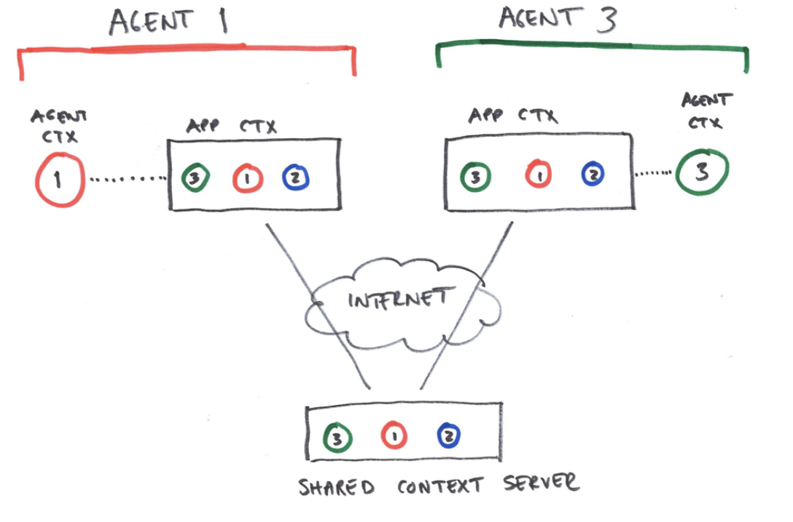

Documentation on GitHub: [https://github.com/mediascape/shared-state/tree/master/API](https://github.com/mediascape/shared-state/tree/master/API)

#### Mapping service

The mapping service provides URLs for Shared State channels, and creates them if they are not already created. Applications can request different scopes for such channels in order to simplify both implementation of the services and ensure a flexible and scalable solution.

Documentation on GitHub: [https://github.com/mediascape/shared-state/tree/master/API#mapping-service-api](https://github.com/mediascape/shared-state/tree/master/API#mapping-service-api)

#### Motion

Orkestra offers the possibility of synchronizing events on a centralized time server. Synchronized objects can be multimedia or not. Multimedia objects do not support synchronization adjustment but the maximum lag between devices is ~ 60ms. If the object to be synchronized is of medium type, a synchronization of ~ 15ms can be achieved.

Documentation on GitHub: [https://github.com/tv-vicomtech/Orkestralib#synchronization-motion](https://github.com/tv-vicomtech/Orkestralib#synchronization-motion)

#### WebRTC services

OrkestraLib offers a real time multimedia consumption through a WebRTC protocol. It implements a JanusGateway solution that allows to manage WebRTC connection effectively and transparently for users. Therefore, orkestraLib allows to publish and consume this type of service through its own Web Components, such as x-media.

Documentation on GitHub: [https://github.com/tv-vicomtech/Orkestralib#webrtc-services](https://github.com/tv-vicomtech/Orkestralib#webrtc-services)

#### User Interface

Orkestra provides an extra layer that enables to make decisions on:

*   Assignation: how to distribute content over different devices / users 
*   Presentation: how to render the content on each of the devices

To do this, it provides a plugin system based on the form of expressjs, which consists of injecting modules and using them when reacting to different types of events. 

The assignation will enable to inject modules that define different rules to decide which component is shown on which device and the presentation will allow to inject modules that define different layout templates to present the components on each screen. Since there could be more than one module for each of the steps, by default the priority is established in the order that they have been registered. 

Finally, for the library to be able to read the components, it is necessary to encapsulate the components within a component called _&lt;orkestra-ui>_:

&lt;orkestra-ui>

&lt;user-table [user]='user'>&lt;/user-table>

&lt;user-table [datos]='data'>&lt;/user-table>

&lt;/orkestra-ui>

Documentation on GitHub: [https://github.com/tv-vicomtech/Orkestralib#user-interface-deployment-and-layout](https://github.com/tv-vicomtech/Orkestralib#user-interface-deployment-and-layout)

## Server Side

The server of Orkestra enables communication and coherent sessions between all the connected devices. 

Code at GitHub: [https://github.com/tv-vicomtech/orkestra-server/tree/master/lib](https://github.com/tv-vicomtech/orkestra-server/tree/master/lib)

### Main modules

#### Core

Central part of the server that integrates and communicates the Sockets Server, the database and the express server. It is implemented in Node.js. 

#### Sockets Server

It provides the communication with the clients through Web Sockets. It is the main part of the multi-device logic that ensures coherence between connected devices and sessions. More in detail, this module has different functionalities:

*   **MappingService:** It is a way to connect to a new session or recover an existing one. It is allowed to enable a security layer for private sessions. (not implemented for orkestraLib)
*   **Sockets Events**: A socket is enabled to receive different events coming from the client side: 
    *   **join**: This event is received whenever a new user is joined.
    *   **disconnect**: This event is received whenever a user is disconnected.
    *   **changePresence**: This event is received whenever a user changes its own status from online to offline or vice versa.
    *   **changeState**: This event is received whenever a user changes the status of any  shared variable.
    *   **initState**: This event is received whenever a user asks for the initial status of a variable.
    *   **getState**: This event is received whenever a user asks for a variable value.
*   **Persistence Data**: All the data shared between websockets are collected at a mongodb database. Any event received from connected users is saved in the database. When the data is saved, an event is triggered to be shared to other users. This approach guarantees to recover any session information although the connections are over.

#### Mongo

This module provides persistence through a MongoDB database. It is used by the Rest API as a persistence database and also to manage websocket’s  asynchronous events with persistence.

#### Express Server

This module enables several web services such as:

*   **Static web server**: Allows to host static files.
*   **Rest API**: Enables functionality as end-point based on RestAPI.
*   **Dynamic web server**: Allows users to use templates to create dynamic web pages.

#### Motion Server

It provides the online timing resources to synchronize different contents. A timing object is instantiated on each of the devices, and each instance is connected to a single, shared online timing resource. If the timing object pauses, all the connected local components are notified and react accordingly. Furthermore, when timing objects are connected to an online timing resource, they merely act as local representatives. For example, when requested to pause, the timing object will simply forward the request to the online timing resource. As the online object pauses, notifications will be multicast to all connected clients.

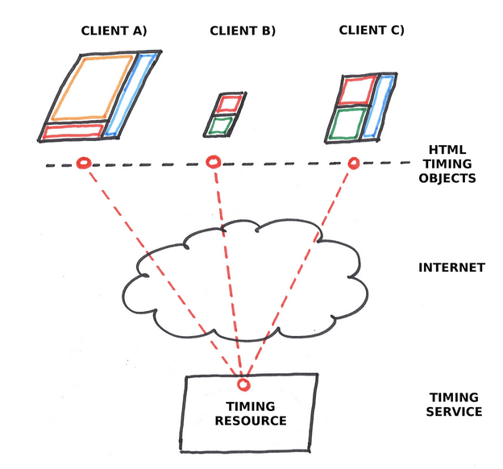

#### Janus Server

Although it is not part of Orkestra it is widely used for publishing and consuming real-time media flows through WebRTC. OrkestraLib, Orkestra's client side; it offers several utilities to publish, consume and configure WebRTC through Janus GateWay transparent manner, so on many deployments of Orkestra this server is included.

## Important sequences

This section describes the events and data flow at the most important sequences used in Orkestra. 

#### Request of session URL (Mapping Service)

Each time we want to create a new session, Mapping Service has to be used. The Mapping Service connects to the server and requests a new session under a name. Then, the server answers with the url to be used for the Shared State. After that, an Application Context is created, which at the same time generates a Shared State with the url received before. Finally, the Application Context notifies its _ready _state.

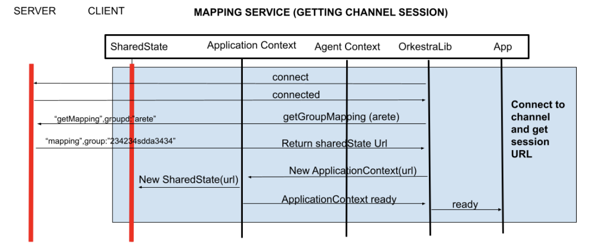

#### Agent Joined (First)

When an agent is connected, after requesting the Shared State url as explained in the previous sequence, an Application Context is generated. This Application Context creates a new local Shared State and connects with the server. After that, when the Application Context notifies orkestraLib about its ready state, OrkestraLib requests for the Keys in the Shared State and it is subscribed to changes on them.

Then, the Shared State sends a _join _request to the server and the server answers with a _joined _event, which is seen as a _presence _event in the Application Context. Next, the Agent Context is generated and OrkestraLib is notified about an _agentChange_. When this is received, it is checked if the _agCtx _in the event is _null _or not. If it is _null_, an _agent_left _event is dispatched and received as a user event. If not, an _agent_join _event is dispatched, the initial state of the capabilities are requested to the server and changes on device capabilities are notified as user events.

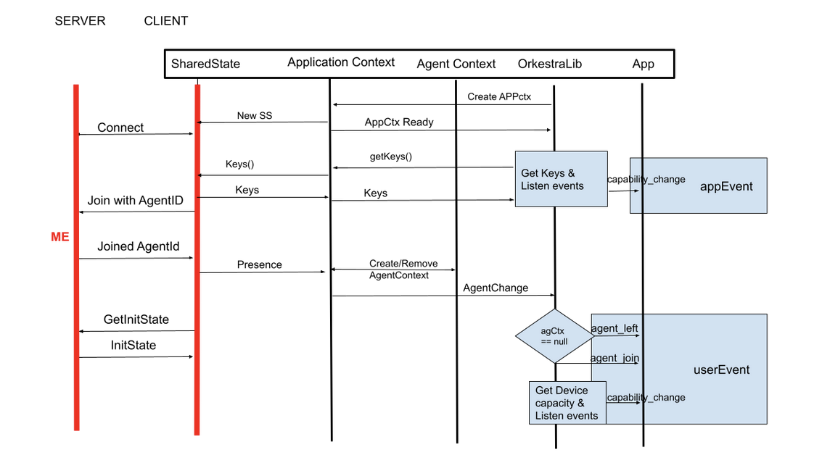

#### Subscribe to global variable and set app attribute

In the upper part of the figure we see that when an agent is subscribed to a global variable, first, the Keys of the available variables in the Application Context are requested. Then, the Application Context does the same with the Shared State. For that, it asks for the variables saved with the prefix “___global_”. The request reaches the server and it returns the information in the opposite direction. Once the keys arrive to orkestraLib, if the agent is not subscribed to the key the app wants to subscribe, it adds a callback to the callback list. That way, when there is a change on that key value, an event is triggered at app level. 

In the bottom part of the figure, we can see the sequence that is followed when we want to change the value of a global variable. First of all, _setAppAttribute() _function is called from the app to OrkestraLib with the key and the value. Then, OrkestraLib transfers this request through the _setItem() _function of the Application Context. In the same way, the Application Context transfers the request to the Shared State but it modifies the key by adding the “___global_” structure at the begining. The Shared State makes the request to the server and the server notifies a _changeState_. The Shared State receives this notification and notifies the Application Context, which triggers the _change _event in OrkestraLib. Finally, the application receives the variable change as an app event.

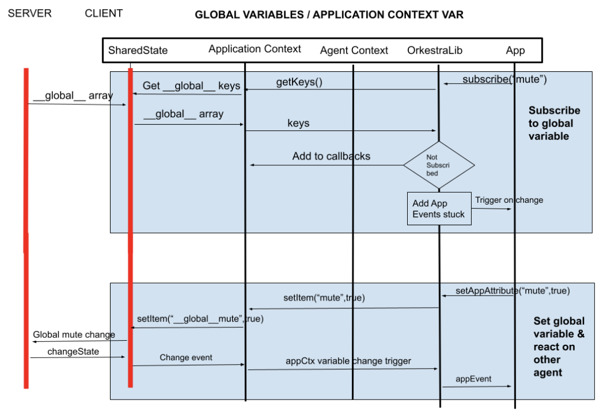

#### Publish and subscribe to User/Agent Capacities

When we want to publish a new capacity at the user or agent (both are the same) context, we call the _data() _function of orkestraLib with the name of the capacity and the arguments to be considered. Then, Orkestralib calls the _load() _function of the Agent Context, which registers the corresponding events and notifies the _keyChange _to the Shared State. The shared state communicates all of this to the server, but for that it uses the structure “___meta__agentid_” before the keyname. That way, it is registered which capacity belongs to which agent.  Once registered, the server notifies a _changeState _to the Shared State. After that, the Shared State communicates the change to the Application Context and the Application Context updates the keys of the Agent Context. Finally, an _agentChange _event is sent to OrkestraLib and triggers a user event towards the app.

On the other hand, when we want to subscribe an agent to a specific capacity of another, the following sequence is followed. First the remote agent has to know the capabilities of the first one. Therefore, when the second agent receives the _readyStateChange _from the server after joining, a _presence _event is triggered from the Shared State to the application context. This sends an _agentChange _event to OrkestraLib with all the capabilities saved in the Shared State. Then, the second agent, through orkestra, subscribes to a specific capacity. For that, it calls the _subscribe() _function of the Agent Context. When the Agent Context receives this request, it adds the “___metasub__agX___” string before the key and transfers the request to the Shared State, which updates the metadata at the server. 

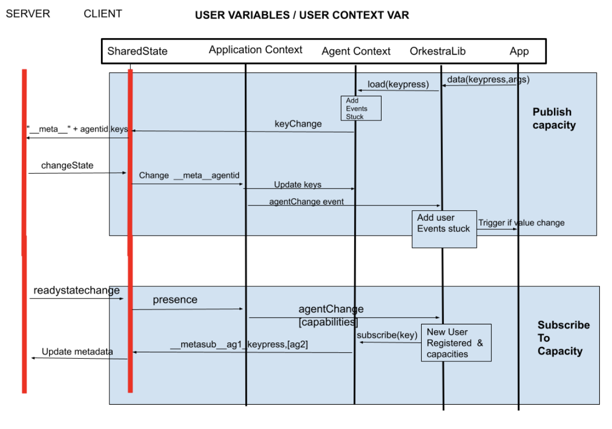

#### Set and Get User/Agent Capacities

When we want to set a value to a capacity of a specific agent, _setUserContextData()_ function of OrkestraLib is used, specifying the agentId, the key and the value. After that, OrkestraLib asks to the Application Context for the Agent Context. When OrkestraLib receives the agent information, it calls _setItem()_ function of the Agent Context with the key and the value. Then, the Agent Context transfers the request to the Shared State, but first, it adds the “___val__agentid___” structure to the key. And finally, the Shared State sends a datagram to the server. The server processes the request and answers with a _changeState _event, which is received by the Shared State and sent through different callbacks towards OrkestraLib. OrkestraLib receives the change and triggers a user event. This change is notified to all the agents subscribed to that capacity.

On the other hand, when we want to obtain the value of a capacity of a specific agent, _getUserContextAgent() _function of OrkestraLib is used. This function receives the agentid and the target key and checks who is the target agent. If it is the same agent, it calls_ getItem()_ function of the Agent Context and the Agent Context returns the value. If not, the request is made to the Application Context, which includes the “___val__agid___” structure and sends the request to the Shared State. The Shared State returns the value to the Application Context and the Application Context to OrkestraLib. Finally the application obtains the value from OrkestraLib.

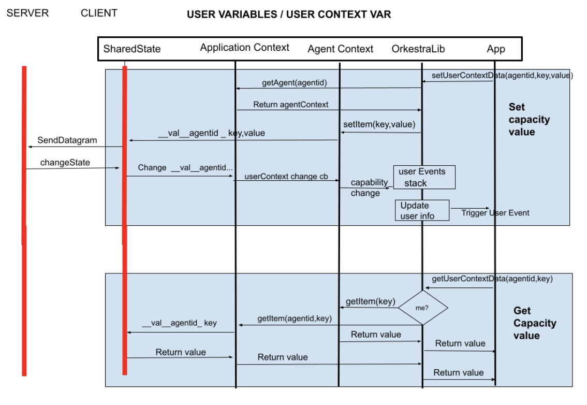

#### Using Assignation Engine

The assignation consists of deciding which components are shown on each device and for that, the Assignation Engine is used. The Assignation Engine allows to include and use different rules to make decisions. Moreover, it is possible to use more than one rule and then make the decision taking into account the priorities of the rules. 

When we want to use a rule, we use from the app, the _use()_ function of orkestraLib, specifying the name of the rule, the listener to take into account and other arguments. That way, the rule and its priority are registered and it can be used whenever we want. In this example, when a capability is changed, OrkestraLib receives the event and executes the rule merging the decisions with those specified by other rules. The result of the Assignation Engine consists of showing or hiding components, which is done at component level through load and unload function. These functions allow to activate and deactivate functionalities at the component scope. For example, a component could have a listener defined while it is shown, but when it is hidden, the listener should be destroyed.

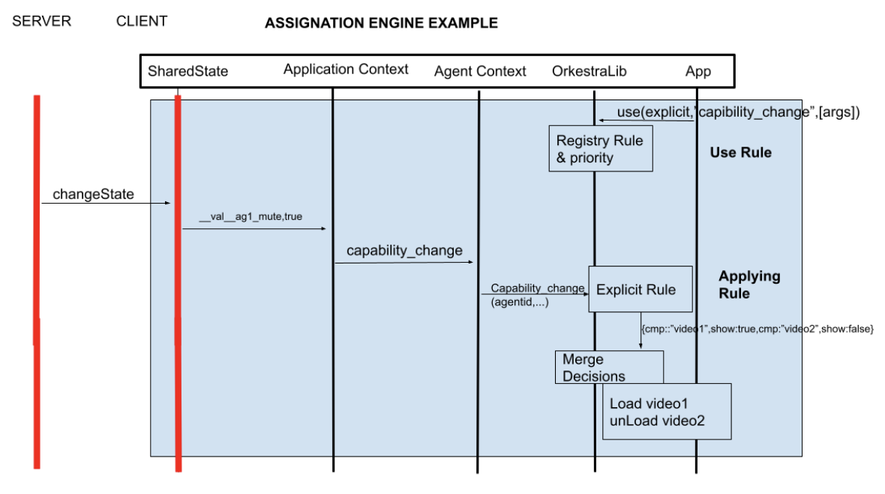

#### Using Presentation Engine

The presentation consists of deciding how to show the components once the assignation is decided, and for that, the presentation engine is used. The Presentation Engine allows developers to register and use different layout templates to define how to present the components on the screen. For that, _ui() _function of OrkestraLib is used, specifying the name of the layout we want to use. That way, the layout is registered and it can be used whenever we want. In this example, when a capability is changed, OrkestraLib receives the event and the Presentation Engine is the one in charge of unloading the previous layout and loading the target one, which will entail style changes.

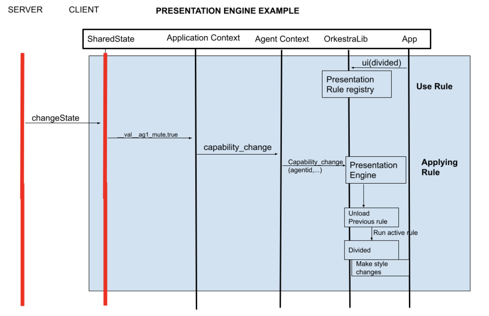

#### Update Components Status when a rule is applied

When a rule of the Assignation Engine is applied for whatever reason (in this example because of a capability change), the result is a decision to show or hide some of the components. But in order to maintain the data update both at the Shared State and the server, the ComponentStatus variable has to be updated. This variable is related to a specific agent and therefore, the sequence will start from the Agent Context. For that, first, OrkestraLib calls the _updateComponentStatus()_ function of the Agent Context. The Agent Context transfers the request to the Shared State including the “___val__agX_componentsStatus_” structure as the key. And finally, the Shared State sends a datagram with the changes to the server. 

That way, any other connected agent will be notified about the changes. Note that even if _componentsStatus _is a variable that belongs to the Agent Context, it is notified to all the connected agents without needing to subscribe to changes there. This happens because _componentsStatus _is considered a core variable and the subscription is done internally for all the connected agents. Therefore, when the _componentsStatus_ variable changes, every agent receives a _changeState_ event at the Shared State. Then, the Shared State updates the information at the Agent Context and the corresponding rules are executed on this second agent.

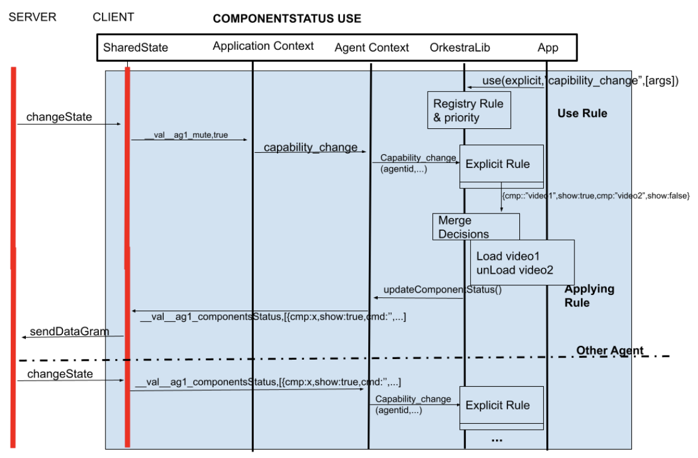

#### Update Components Status Manually

In the previous sequence we have seen how _componentsStatus _variable is updated when an assignation rule is run. However, this update could also be done manually for a specific component of a specific agent. In this case, the same _updateComponentStatus()_ function of OrkestraLib is used from the app, but this time, the changes are included as arguments. These arguments include the _agentId_, the _componentId_ and the value to change. In this example, the _mute _status of a component is changed. OrkestraLib transfers the request to the Agent Context and the Agent Context sends the request to the Shared State including the “___val__componentsStatus__agX_” as key. Finally, the Shared State sends a datagram with the change to the server.

When the server processes the change, it sends a _changeState_ event to the Shared State and the Shared State updates the capabilities at the Agent Context. Then, a user event is triggered at orkestraLib and the application updates the component, in this case it mutes the _video1 _component.

Note that the rest of the agents will also be notified about the change, since we are talking about componentsStatus variable.

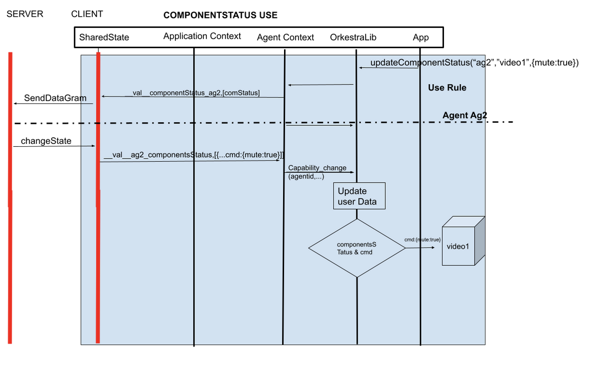

#### Use of motion

Motion allows us to synchronize different contents according to shared timers. There are two ways of synchonization:

*   Sequencer: it is used in order to synchonize non multimedia contents as for example, different data that have to be shown at the same time. This could be useful in a scene based timeline where each scene is associated with a number of data that have to be used at the same time.
*   Multimedia synch: it is used when different multimedia contents have to be synchronized. In order to do that, the playbackrate of the contents is accurately adjusted at each element to be synchronized with a common timestamp.

In this case, we describe a sequence for each of the synching modes.

In order to use the Sequencer, _enableSequencer()_ function is called from the application, specifying the object to synchronize and the _channel_. The channel allows to define different synchronization threads in case it is needed. Then orkestraLib registers the timer at Motion Server and we can start to use the Sequencer. For that, the timer controller defines the time and velocity through the _start()_ function, and each time there is a timeupdate, orkestraLib is notified at its timer listener, wich executes the rule we want. In this case, byTimeline rule is used.

On the other hand, when we want to synchronize multimedia components, we call from the app the _syncObjects()_ function of OrkestraLib, specifying the component we want to synchronize and the channel we want to use. Again, the channel allows us to use different synchronization threads. After that, orkestraLib calls the _addMultimediaObject()_ function of the Motion server. This sequence is repeated with the second component we want to synchronize. And then, each time there is a timeupdate from the motion server, the client part of motion in OrkestraLib adjusts the playbackrate of each component. In this case, video1 and video 2 will be synchronized. 

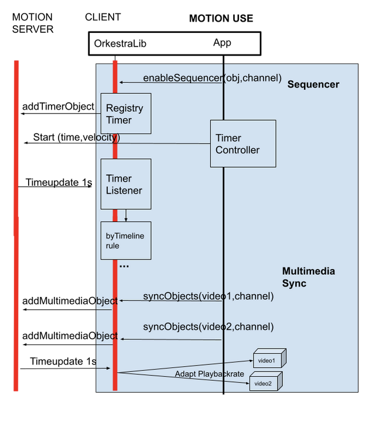

